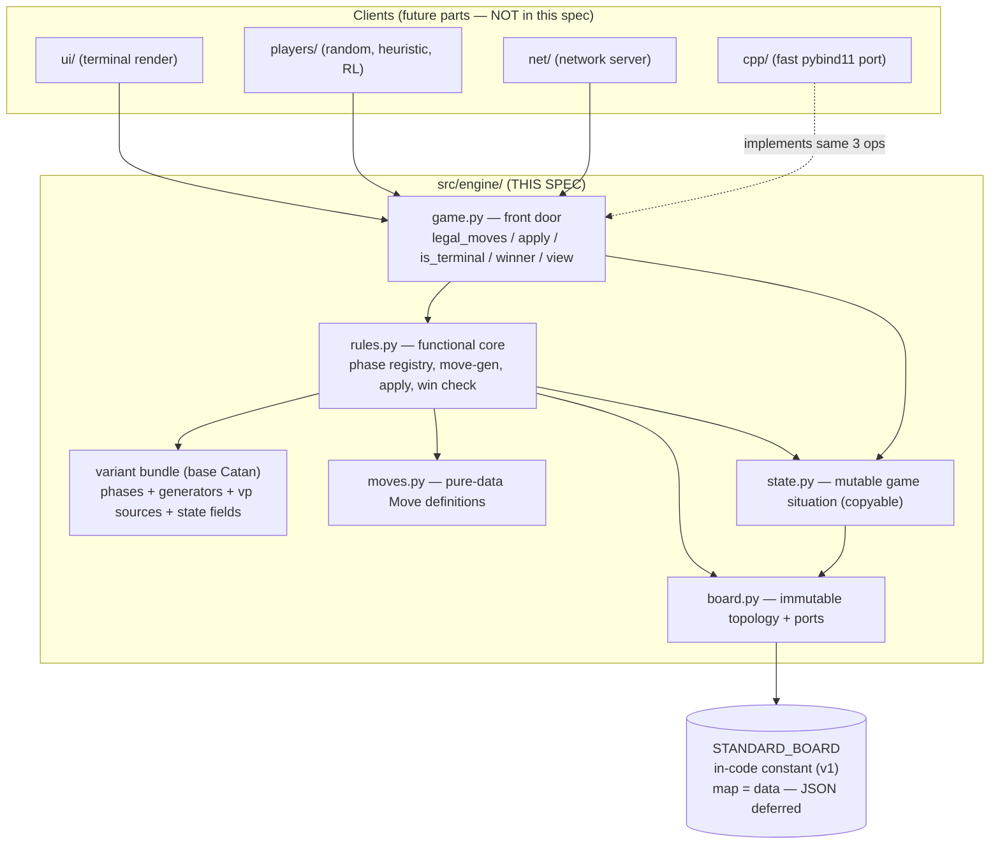
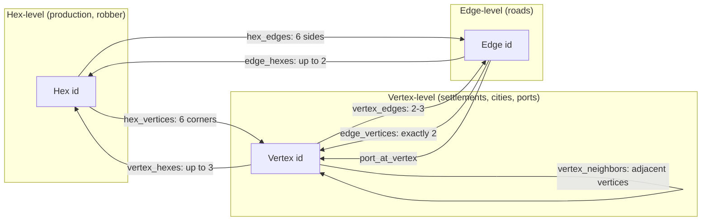
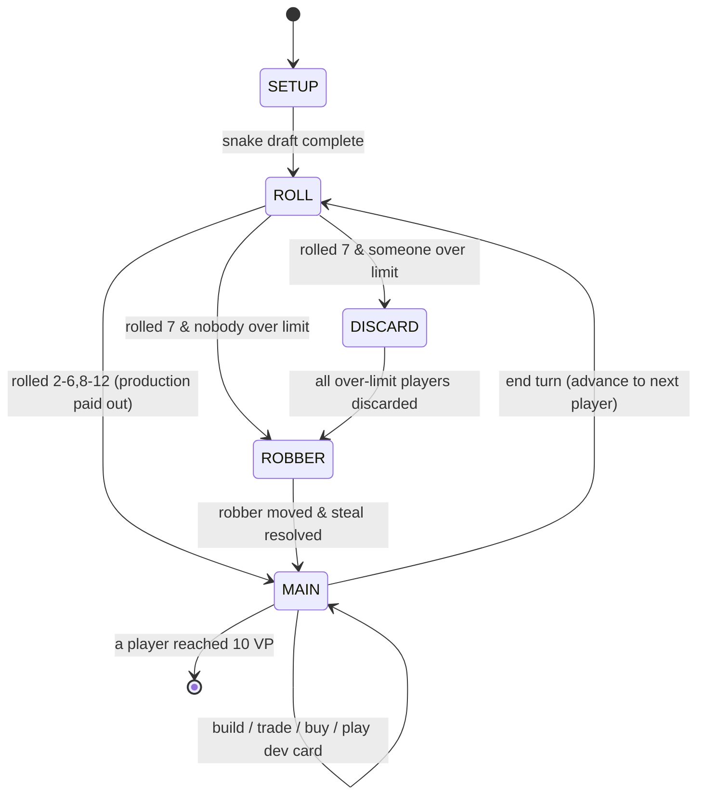

# Design Document: catan-engine

## Overview

`catan-engine` is a pure rules library for base Catan. It knows the rules and
nothing else: it does no printing, no input, no networking, and no AI. Every
other part of the project (terminal UI, bots, RL training, network server, and a
future C++/pybind11 port) is a *client* of this engine and talks to it through a
tiny, stable front door of **three operations**:

1. `legal_moves(state) -> list[Move]` — what may happen next.
2. `apply(state, move) -> State` — make it happen, producing the next state.
3. `is_terminal(state) -> bool` / `winner(state) -> Optional[int]` — is the game
   over, and who won.

The engine is written in Python first as a *correct, slow, extensible reference*.
A faster C++/pybind11 implementation is a later part of the project; this design
deliberately keeps the three operations narrow and the state plain-data so the
same three calls can back either implementation without changing any client.

Two further commitments shape every decision below. First, **topology is
addressed by integer IDs** (hexes, vertices, edges numbered `0..N`) rather than
object references, so a `State` is cheap to copy and trivial to serialize — a
hard requirement for MCTS self-play and for network payloads later. Second, the
engine is built to **extend, not fork**: base Catan is implemented as one named
*variant bundle* (a data-driven ruleset module: phases + legal-move generators +
extra state fields + victory point sources + tunable counts), and future
variants (Seafarers, Cities & Knights) are expected
to add bundles rather than rewrite the core. Only base Catan is implemented in
this spec, but the seams for variants are part of the design.

---

# PART A — HIGH-LEVEL DESIGN

This part describes the engine's shape: how the pieces fit, the board graph
model, the turn state machine, the data models, and the thin surface other
folders will call. The focus of this spec is the engine only; integration points
are described just enough to prove the seams are clean.

## Architecture

The engine is a layered library. The **front door** (`game.py`) is the only thing
clients import. Underneath, plain-data *nouns* (`Board`, `State`, `Move`) are
acted on by a functional core of *verbs* (`rules.py`) that is organized as a
registry of phase handlers. The `Board` is immutable topology loaded once from a
data file; the `State` is the mutable game situation.



Key properties of this architecture:

- **One-way dependencies.** Clients depend on `game.py`; `game.py` depends on
  `rules.py`; `rules.py` depends on the nouns and the active variant bundle. The
  nouns never import the verbs. This is what lets the C++ port replace the core
  without touching clients.
- **Board vs State split.** `Board` is loaded once and never mutated during a
  game. `State` holds everything that changes. Many `State`s can share one
  `Board` by reference, so copying a `State` never copies topology.
- **Variant as a bundle.** `rules.py` does not hardcode "base Catan." It asks the
  active *variant bundle* (a data-driven ruleset module) for its ordered phases,
  its legal-move generators per phase, the extra state fields it needs, its
  victory-point sources, and its tunable counts (dev-deck composition, piece
  limits, VP target). Base Catan is one such bundle.

## A.2 The board graph model

Catan is played on a graph of three element kinds, all addressed by integer ID:

- **Hexes** `0..H-1` — produce resources; carry a number token; one hosts the
  robber.
- **Vertices** `0..V-1` — corners where settlements/cities sit; some carry a port.
- **Edges** `0..E-1` — sides where roads sit.

The `Board` stores precomputed adjacency lookup tables between these. This is the
reusable idea confirmed by the Bunge generator (a hardcoded integer adjacency
table), extended with the vertices, edges, and ports that generator lacks. Per
`map-ingestion-flow.md`, IDs are derived deterministically from axial/cube hex
coordinates at load time, but at runtime the engine only ever uses the integer
IDs and the lookup tables. In v1 the source data is an in-code constant
(`STANDARD_BOARD`) rather than a file (see A.6); the derivation and lookup-table
construction are identical regardless of where the raw data comes from.



These tables answer every spatial question the rules need, in O(1):

| Question a rule asks | Table used |
|----------------------|------------|
| Which hexes does this vertex touch? (production payout) | `vertex_hexes[v]` |
| Which vertices are too close for the distance rule? | `vertex_neighbors[v]` |
| Which edges can a road at this edge connect to? | `edge_vertices[e]` → `vertex_edges[v]` |
| Which vertices are robber-stealable? | `hex_vertices[robber_hex]` |
| Does this vertex have a port, and what ratio? | `ports[v]` |

Because adjacency is **data**, a bigger or differently shaped board is just a
different dataset — there is no fixed-size assumption and no bitboard ceiling.
In v1 that dataset is the in-code `STANDARD_BOARD` constant; swapping it for a
file changes only the source, not the runtime model.

## A.3 The turn phase machine (FSM)

The turn is modeled as a finite state machine whose states are **phases**. The
FSM is *data-driven*: the phase sequence is *assembled from the variant bundle as
data*, not hardcoded — this is the single most important extensibility surface
(variation knob 7). For base Catan the phases are:



Phase semantics:

- **SETUP** — snake draft. Each player places settlement + road, then in reverse
  order a second settlement + road. The *second* settlement immediately yields one
  resource from each adjacent producing hex.
- **ROLL** — the active player may first play one dev card, then rolls 2d6.
  Production is paid out, unless the roll is 7.
- **DISCARD** — on a 7, every player holding more than the discard limit discards
  half (rounded down). This is a multi-player phase: the FSM stays in DISCARD
  until every over-limit player has submitted a discard move.
- **ROBBER** — the roller moves the robber to a new hex and steals one random
  card from an opponent on that hex (also entered by playing a Knight).
- **MAIN** — free-order build / bank-or-port trade / buy / play-one-dev-card,
  terminated by an end-turn move (which checks victory, then advances to the next
  player and returns to ROLL). Player-to-player (negotiated) trading is **out of
  scope for v1** — see "Future Work / Out of Scope (v1)" below.

The current phase lives in `State.phase`. `rules.legal_moves` dispatches on it
through the phase registry; `rules.apply` performs the phase's effect and decides
the next phase. No client ever sees this machinery — they just see the moves the
current phase allows.

## A.3.1 Longest road (precise definition)

Longest road is **not** a simple tree traversal, and must not be implemented as
one. The precise definition:

- Consider the subgraph of the board's edges that a player owns (their roads).
  This subgraph may **branch** and may contain **cycles** — it is a general
  graph, not a tree.
- Longest road for that player is the length of the **longest simple path**
  (no repeated edge, no repeated vertex) over that road subgraph.
- An **opponent's settlement or city placed on a vertex breaks path continuity
  through that vertex**: a path may not pass *through* a vertex occupied by an
  opponent's building (it may still start/end there, but cannot continue past).
  A player's own building never breaks their path.
- The Longest Road bonus (2 VP) goes to the player with the longest such path of
  length ≥ 5, with standard tie/steal handling.

**Complexity & algorithm choice (implementation detail).** Longest simple path is
NP-hard in general, but **trivial at Catan's scale**: a player has at most 15
road segments, so an exhaustive depth-first search over the road subgraph is more
than fast enough. The engine recomputes longest road via DFS whenever a player's
roads change *or* a settlement/city is placed (an opponent building can shorten
it). The board's edge↔vertex↔edge adjacency tables (A.2) are exactly what this
traversal walks; they remain available for it. The specific search is an
implementation detail, but the definition above is the contract and must not be
reduced to a tree walk.

## Components and Interfaces

### Component: `board.py` — immutable topology

**Purpose**: Load a scenario's map data once and answer adjacency queries by
integer ID. Never changes during a game.

**Interface** (Python type hints; full signatures in Part B):
```python
class Board:
    def num_hexes(self) -> int: ...
    def num_vertices(self) -> int: ...
    def num_edges(self) -> int: ...
    def vertex_hexes(self, v: int) -> tuple[int, ...]: ...
    def vertex_neighbors(self, v: int) -> tuple[int, ...]: ...
    def vertex_edges(self, v: int) -> tuple[int, ...]: ...
    def edge_vertices(self, e: int) -> tuple[int, int]: ...
    def hex_vertices(self, h: int) -> tuple[int, ...]: ...
    def hex_resource(self, h: int) -> Resource: ...
    def hex_number(self, h: int) -> int: ...      # 0 = desert / no token
    def port_at(self, v: int) -> Optional[Port]: ...

# v1: builds the Board from the in-code STANDARD_BOARD constant.
# The signature is kept file-shaped so JSON loading can drop in later
# without changing callers (see A.6 and the Future Work note).
def load_board(scenario_dir: str = "standard") -> Board: ...
```

**Responsibilities**: obtain the canonical map data — in v1 from the in-code
`STANDARD_BOARD` constant, later from scenario files (deferred) — in the shared
data *shape*; derive vertex and edge IDs from hex coordinates; build and freeze
the adjacency tables; expose read-only queries. Hosts no mutable game data.

### Component: `state.py` — mutable game situation

**Purpose**: Hold everything that changes during a game, in a form cheap to copy
and serialize. References its `Board` but never copies it.

**Interface**:
```python
@dataclass
class State:
    board: Board                      # shared reference, never copied
    variant: str                      # bundle name, e.g. "base"
    num_players: int
    current_player: int
    phase: Phase
    # occupancy arrays indexed by integer ID (-1 = empty)
    settlements: list[int]            # vertex_id -> owner or -1
    cities: list[int]                 # vertex_id -> owner or -1
    roads: list[int]                  # edge_id   -> owner or -1
    robber_hex: int
    # per-player tallies
    resources: list[dict[Resource, int]]
    dev_cards: list[dict[DevCard, int]]
    dev_cards_playable: list[dict[DevCard, int]]   # excludes bought-this-turn
    played_knights: list[int]
    # shared decks / bonuses
    dev_deck: list[DevCard]
    bank: dict[Resource, int]
    longest_road_holder: int          # -1 if none
    largest_army_holder: int          # -1 if none
    # bookkeeping
    dice: Optional[tuple[int, int]]
    setup_index: int                  # progress through snake draft
    pending_discards: list[int]       # players still owing a discard
    move_log: list[Move]              # source of truth for replay
    rng_state: tuple                  # seedable RNG, for reproducibility

    def copy(self) -> "State": ...     # deep-copies mutable fields, shares board
```

**Responsibilities**: be a plain data container; provide a `copy()` that
deep-copies the mutable fields and shares the immutable `Board`. Holds no rules
logic.

### Component: `moves.py` — pure-data moves

**Purpose**: Define what a move *is*. A `Move` is an immutable dataclass
describing **intent only** — it carries no behavior and mutates nothing. This is
"Design B": `rules.apply` does all mutation.

**Interface** (one frozen dataclass per move kind; see Part B for fields):
```python
class Move: ...                       # common base / union
# BuildRoad, BuildSettlement, BuildCity, Roll, MoveRobber, Steal,
# BuyDevCard, PlayKnight, PlayRoadBuilding, PlayYearOfPlenty, PlayMonopoly,
# BankTrade, PortTrade, Discard, EndTurn, PlaceSetupSettlement,
# PlaceSetupRoad
```

**Responsibilities**: describe intent as data; be hashable/serializable so move
logs replay deterministically. No game logic.

### Component: `rules.py` — the functional core

**Purpose**: Generate legal moves, apply moves, run the phase machine, and check
victory. Split into **common** rules and **base-variant** rules so a future
variant can reuse the common parts and override the rest.

**Interface**:
```python
def legal_moves(state: State) -> list[Move]: ...
def apply(state: State, move: Move, in_place: bool = False) -> State: ...
def is_terminal(state: State) -> bool: ...
def winner(state: State) -> Optional[int]: ...
def victory_points(state: State, player: int) -> int: ...
```

**Responsibilities**: own all rule logic; dispatch by phase via the variant
bundle's registry; never do IO.

### Component: `game.py` — the front door

**Purpose**: Tie it together and expose the small stable surface every client
uses. This is the *only* module clients import.

**Interface**:
```python
class Game:
    @staticmethod
    def new(scenario_dir: str, num_players: int, seed: int) -> State: ...
    @staticmethod
    def legal_moves(state: State) -> list[Move]: ...
    @staticmethod
    def apply(state: State, move: Move, in_place: bool = False) -> State: ...
    @staticmethod
    def is_terminal(state: State) -> bool: ...
    @staticmethod
    def winner(state: State) -> Optional[int]: ...
    @staticmethod
    def view(state: State, player: int) -> PlayerView: ...      # hidden-info filter
    @staticmethod
    def replay(scenario_dir: str, num_players: int, seed: int,
               moves: list[Move]) -> State: ...                 # from move log
```

**Responsibilities**: construct new games, delegate the three operations to
`rules.py`, provide the player `view` (observation) function, and replay a move
log. Adds no rules of its own.

## A.5 How clients (future parts) integrate

The engine's whole external contract is the `Game` surface above. The table shows
how each future folder uses it — included only to confirm the seam is clean; none
of these are built in this spec.

| Client (future) | Uses | Notes |
|-----------------|------|-------|
| `ui/` | `legal_moves`, `apply`, `view` | renders `view(state, p)`; offers `legal_moves` as menu; never inspects rules |
| `players/` (bots) | `legal_moves`, `apply` (copy path), `view` | MCTS copies state and rolls out; heuristic scores `legal_moves` |
| `net/` | `view`, `apply`, `move_log` | sends each client its own `view`; ships the move log for replay/sync |
| `cpp/` | reimplements the same 3 ops | plain-data state + integer IDs make a pybind11 port mechanical |

The two design choices that make all four cheap: integer-ID state that copies and
serializes trivially, and a single `view` function that filters hidden
information per player (used both for RL observations and per-client network
payloads).

## A.6 Future Work / Out of Scope (v1)

The following are deliberately deferred. The seams are designed so each can be
added without reworking the core.

- **Player-to-player (negotiated) trading.** Trading with other players is a
  *core part of Catan* and **will be added later**, but it is **out of scope for
  v1**. Negotiation — offers, counter-offers, and acceptance across multiple
  players — does not fit the simple "list of legal moves for the current player"
  model cleanly (it is multi-party and stateful in a way the current FSM does not
  express). v1 therefore supports **only bank trades (4:1) and port trades
  (3:1 / 2:1)**. No legal-move generator and no `Move` kind in v1 represents a
  player-to-player trade. Adding it later will likely introduce a negotiation
  sub-phase and dedicated offer/response move kinds.
- **JSON / file-based board loading.** v1 reads the standard board from the
  in-code `STANDARD_BOARD` constant; file loading + validation is deferred (see
  the Data Models TODO and `map-ingestion-flow.md`).
- **Non-base variants** (Seafarers, Cities & Knights, etc.) — the variant-bundle
  seams exist but only the `base` bundle is implemented.

## Data Models

### Model: board data ("map = data") — v1 in-code constant

The canonical map data has a fixed *shape* (per `map-ingestion-flow.md`): a set
of hexes, each with axial/cube coordinates, a resource type, and a number token;
plus a set of ports (vertex bindings + ratios); plus the name of the variant
bundle to load. Vertex and edge IDs are **derived** from the hex coordinates at
load time — they are not stored in the source data.

**v1 decision — defer JSON, hardcode the standard board in code.** Rather than
parse files, v1 ships the standard base board as an in-code Python constant,
written in the *same shape* the future data file will take so it is a drop-in
replacement later:

```python
# board_data.py — the standard base Catan board as data (v1).
# Same shape as the future scenarios/standard/*.json bundle, so swapping
# the source for file loading touches only load_board(), not this shape.
STANDARD_BOARD = {
    "meta":   {"name": "standard", "player_counts": [3, 4], "vp_target": 10},
    "hexes":  [  # 19 tiles, rows 3-4-5-4-3
        {"coord": [0, -2], "resource": "ore",  "number": 10},
        {"coord": [1, -2], "resource": "sheep","number": 2},
        # ... desert carries no number token ...
    ],
    "ports":  [  # 9 ports: vertex bindings + ratios (4 generic 3:1, 5 specific 2:1)
        {"vertices": [0, 1], "ratio": 3, "resource": None},
        {"vertices": [3, 4], "ratio": 2, "resource": "wheat"},
        # ...
    ],
    "rules":  "base",                 # variant bundle to load
}
```

**Validation rules** (same checks the future file loader will run — see
`map-ingestion-flow.md` Stage 1; applied to the in-code constant in v1):
- every producing hex has exactly one number token; desert has none;
- adjacency is consistent (no vertex references a missing hex);
- port count and ratios are legal;
- the named bundle exists (`"base"`).

> **TODO / Future Work:** swap the in-code board constant (`STANDARD_BOARD`) for
> JSON file loading + validation (per `map-ingestion-flow.md`). The on-disk shape
> is the same bundle sketched below, so only the *source* of the data changes;
> `load_board` keeps its signature and the derived runtime `Board` is identical.
>
> ```
> scenarios/standard/        # FUTURE — not parsed in v1
>   meta.json      # name, player counts (3-4), VP target (10), sets needed
>   board.json     # 19 tiles: axial/cube coords + resource type, rows 3-4-5-4-3
>   numbers.json   # number token per producing hex (2..12 except 7)
>   ports.json     # 9 ports: vertex bindings + ratios (4 generic 3:1, 5 specific 2:1)
>   rules.json     # variant bundle to load -> "base"
> ```

### Model: `Board` (runtime, immutable)

| Field | Type | Meaning |
|-------|------|---------|
| `hex_resource` | `tuple[Resource, ...]` | per-hex resource (or desert) |
| `hex_number` | `tuple[int, ...]` | per-hex token; `0` = none |
| `hex_vertices` | `tuple[tuple[int,...], ...]` | 6 corner vertex IDs per hex |
| `hex_edges` | `tuple[tuple[int,...], ...]` | 6 side edge IDs per hex |
| `vertex_hexes` | `tuple[tuple[int,...], ...]` | ≤3 hex IDs per vertex |
| `vertex_neighbors` | `tuple[tuple[int,...], ...]` | adjacent vertices (distance rule) |
| `vertex_edges` | `tuple[tuple[int,...], ...]` | incident edges per vertex |
| `edge_vertices` | `tuple[tuple[int,int], ...]` | the 2 endpoints per edge |
| `ports` | `dict[int, Port]` | vertex ID → port (ratio, resource) |

All fields are tuples/frozen — the `Board` is immutable after `load_board`.

### Model: `State` (runtime, mutable, copyable)

Defined in A.4. Design points:
- buildings are stored as **occupancy arrays** indexed by integer ID (`-1` =
  empty), not as objects — cheap to copy and compare;
- variant-specific data is *additive*: base Catan simply leaves unused fields out
  of its bundle; Cities & Knights would add commodity/knight fields without
  touching base;
- `move_log` is the **source of truth** for save/load and replay — the engine
  never stores a history of past `State`s, only the moves that produced the
  current one;
- `rng_state` is an explicit seedable RNG (the Bunge generator's seedable-LCG
  idea) so dice, deck shuffles, and steals are reproducible for tests and replay.

### Model: `Move` (pure data)

A frozen dataclass per kind, carrying only intent. Examples:
```python
@dataclass(frozen=True)
class BuildSettlement(Move): vertex: int
@dataclass(frozen=True)
class MoveRobber(Move): hex: int; steal_from: Optional[int]
@dataclass(frozen=True)
class BankTrade(Move): give: Resource; receive: Resource    # 4:1
@dataclass(frozen=True)
class PortTrade(Move): give: Resource; receive: Resource; ratio: int
```
Moves are comparable and hashable so a `move_log` replays deterministically.
Note: v1 defines **no** player-to-player trade move — only `BankTrade` and
`PortTrade` exchange resources (see A.6, Out of Scope).

## Error Handling

| Scenario | Condition | Engine response |
|----------|-----------|-----------------|
| Illegal move submitted | `move ∉ legal_moves(state)` | raise `IllegalMove`; state unchanged |
| Malformed scenario file | validation fails at load | raise `InvalidScenario` with the failing rule |
| Apply on terminal state | `is_terminal(state)` already true | raise `GameOver` |
| Steal target with no cards | robber on hex, victim empty | legal; resolves as "no card stolen" |
| Replay divergence | logged move not legal at its point | raise `ReplayError` with move index |

The engine validates inside `apply` by checking membership in `legal_moves` (the
correctness contract in A.8), so no illegal move can ever mutate state. Recovery
is the caller's job — the engine guarantees the failed `apply` left state
untouched (it validates before mutating, or operates on a copy).

## Correctness Properties

These are the universal properties the engine must satisfy; Part B restates the
critical ones as assertions, and they seed the property-based tests.

### Property 1: Apply purity (copy path)
For all states `s` and moves `m`,
`apply(s, m, in_place=False)` returns a new state and leaves `s` byte-for-byte
unchanged. ∀ s, m: serialize(s) unchanged after copy-path apply.

### Property 2: In-place / copy equivalence
For all `s, m`, the state from
`apply(s.copy(), m, in_place=True)` equals `apply(s, m, in_place=False)`.
∀ s, m: in_place result ≡ copy result.

### Property 3: Legality closure
`apply` accepts a move iff it is in
`legal_moves`. ∀ s, m: `apply(s, m)` succeeds ⇔ `m ∈ legal_moves(s)`.

### Property 4: Legal moves never empty (until terminal)
∀ s: `¬is_terminal(s) ⇒ legal_moves(s) ≠ ∅`. The game can never deadlock.

### Property 5: Resource conservation
Total resources in play + bank is
invariant except at production (bank → players) and discard/steal (players ↔
players/bank). ∀ reachable s: counts are non-negative and the bank never goes
negative.

### Property 6: Victory is a sum of sources
`victory_points(s, p)` equals the
sum of the variant's point-source contributions, never a hardcoded check.
`winner` returns `p` iff `victory_points(s, p) ≥ target` and it is `p`'s turn.

### Property 7: Distance rule
No two settlements/cities ever occupy adjacent
vertices. ∀ reachable s, ∀ v with a building: no neighbor of `v` has a building.

### Property 8: Road connectivity
Every road belongs to a path connected to one
of its owner's settlements/cities.

### Property 9: Serialize/replay round-trip
Replaying `move_log` from the seed
reproduces the current state exactly. ∀ s: `replay(seed, s.move_log) ≡ s`.

### Property 10: View soundness
`view(s, p)` reveals exactly `p`'s own hidden
information (own dev cards, own resources) and never another player's hidden
cards, while exposing all public facts. Two states differing only in another
player's hidden cards yield identical views for `p`.

## Testing Strategy

**Unit testing.** Per-component tables: board adjacency (each table symmetric and
consistent), each move's legal-move generator, each `apply` effect, the phase
transitions, and `victory_points` summation.

**Property-based testing.** The properties in A.8 are checked with **Hypothesis**.
The central strategy is a *random legal playthrough*: from a new game, repeatedly
pick a random move from `legal_moves` and `apply` it, asserting the invariants
(2,3,4,5,7,8) hold at every step and that every game terminates. Round-trip
properties (1,9) and view soundness (10) get dedicated strategies.

**Property Test Library**: Hypothesis (Python).

**Integration testing.** Full scripted games from setup to a 10-VP win, plus a
replay test: play a random game, save its `move_log`, `replay` it, assert
identical final state.

## A.10 Dependencies

- Python 3.11+ (dataclasses, type hints).
- Standard library only for the engine core (`json`, `dataclasses`, `random` or a
  small seedable RNG, `copy`).
- `hypothesis` and `pytest` for tests (dev dependency).
- No UI / network / numeric libraries — those belong to client folders.

---

# PART B — LOW-LEVEL DESIGN

This part gives concrete Python signatures, formal specifications
(preconditions / postconditions / invariants), and algorithmic pseudocode for
the three front-door operations, legal-move generation, `apply` with its
in-place vs copy paths, the phase registry, and the player-view function. Python
is the chosen language (per the user); the C++ port later mirrors these same
shapes.

## B.1 Core types

```python
from dataclasses import dataclass, field
from enum import Enum
from typing import Optional, Callable

class Resource(Enum):
    WOOD = "wood"; BRICK = "brick"; SHEEP = "sheep"
    WHEAT = "wheat"; ORE = "ore"

class DevCard(Enum):
    KNIGHT = "knight"; VICTORY_POINT = "vp"; ROAD_BUILDING = "road_building"
    YEAR_OF_PLENTY = "year_of_plenty"; MONOPOLY = "monopoly"

class Phase(Enum):
    SETUP = "setup"; ROLL = "roll"; DISCARD = "discard"
    ROBBER = "robber"; MAIN = "main"; GAME_OVER = "game_over"

@dataclass(frozen=True)
class Port:
    ratio: int                         # 3 (generic) or 2 (specific)
    resource: Optional[Resource]       # None for generic 3:1
```

## B.2 The variant bundle (extend-don't-fork core)

A variant is a named bundle of data + functions. `rules.py` is generic over the
bundle; base Catan is one instance. Adding Seafarers later = registering another
bundle, not editing the core.

```python
@dataclass(frozen=True)
class VariantBundle:
    name: str
    # ordered phases the FSM may occupy
    phases: tuple[Phase, ...]
    # per-phase legal-move generator: phase -> (state -> list[Move])
    generators: dict[Phase, Callable[["State"], list["Move"]]]
    # per-move-kind effect applied to a (mutable) state, returns next phase
    effects: dict[type, Callable[["State", "Move"], Phase]]
    # victory-point sources: list of (state, player) -> int contributions
    vp_sources: tuple[Callable[["State", int], int], ...]
    # extra state fields this variant needs (name -> default factory)
    extra_state: dict[str, Callable[[], object]]
    # ---- tunable counts (configuration, NOT magic constants in logic) ----
    vp_target: int                                  # victory points to win (10)
    dev_deck_composition: dict[DevCard, int]        # how many of each dev card
    piece_limits: dict[str, int]                    # {"road","settlement","city"}
    discard_limit: int                              # hand size that triggers discard on a 7
    longest_road_min: int                           # min length to claim Longest Road
    largest_army_min: int                           # min knights to claim Largest Army
    build_costs: dict[type, dict[Resource, int]]    # cost per build Move kind

VARIANTS: dict[str, VariantBundle] = {}          # registry

def register_variant(bundle: VariantBundle) -> None:
    VARIANTS[bundle.name] = bundle
```

**base bundle (illustrative registration):**
```python
BASE = VariantBundle(
    name="base",
    phases=(Phase.SETUP, Phase.ROLL, Phase.DISCARD, Phase.ROBBER, Phase.MAIN),
    generators={
        Phase.SETUP:   gen_setup_moves,
        Phase.ROLL:    gen_roll_moves,
        Phase.DISCARD: gen_discard_moves,
        Phase.ROBBER:  gen_robber_moves,
        Phase.MAIN:    gen_main_moves,
    },
    effects={
        Roll: eff_roll, MoveRobber: eff_move_robber, Discard: eff_discard,
        BuildRoad: eff_build_road, BuildSettlement: eff_build_settlement,
        BuildCity: eff_build_city, BuyDevCard: eff_buy_dev, EndTurn: eff_end_turn,
        # ... one effect per Move kind
    },
    vp_sources=(vp_from_buildings, vp_from_vp_cards,
                vp_from_longest_road, vp_from_largest_army),
    extra_state={},                 # base needs no additive fields
    # ---- tunable counts: standard base Catan values, overridable by variants/tests ----
    vp_target=10,
    dev_deck_composition={          # 25 cards total
        DevCard.KNIGHT: 14, DevCard.VICTORY_POINT: 5, DevCard.ROAD_BUILDING: 2,
        DevCard.YEAR_OF_PLENTY: 2, DevCard.MONOPOLY: 2,
    },
    piece_limits={"road": 15, "settlement": 5, "city": 4},
    discard_limit=7,
    longest_road_min=5,
    largest_army_min=3,
    build_costs={
        BuildRoad:       {Resource.WOOD: 1, Resource.BRICK: 1},
        BuildSettlement: {Resource.WOOD: 1, Resource.BRICK: 1,
                          Resource.SHEEP: 1, Resource.WHEAT: 1},
        BuildCity:       {Resource.WHEAT: 2, Resource.ORE: 3},
        BuyDevCard:      {Resource.SHEEP: 1, Resource.WHEAT: 1, Resource.ORE: 1},
    },
)
register_variant(BASE)
```

> **Configuration, not magic constants.** The standard base values above
> (dev-deck composition 14 knight / 5 VP / 2 road-building / 2 year-of-plenty /
> 2 monopoly; piece limits 15 roads / 5 settlements / 4 cities; 9 ports from the
> board data; VP target 10) are **confirmed correct** but are carried as
> configuration on the `VariantBundle` (and read by the rules) rather than baked
> into logic, so a variant or a test can override any of them. Rules code reads
> e.g. `activeBundle(s).build_costs[BuildRoad]` and
> `activeBundle(s).piece_limits["settlement"]` instead of module-level constants.
> Port count/ratios are configuration too, but live in the board data (A.2 /
> Data Models) since they are positional. **Verify exact counts against the
> rulebook during implementation.**

## B.3 Front-door operation 1: `legal_moves`

```python
def legal_moves(state: State) -> list[Move]:
    """Return every move legal in `state`, dispatched by phase."""
```

**Preconditions:**
- `state` is a well-formed, reachable state.
- `state.phase` is a phase in the active variant bundle.

**Postconditions:**
- Returns a list containing exactly the legal moves for `state.phase`.
- The list is non-empty whenever `not is_terminal(state)` (property 4).
- No side effects: `state` is unchanged.

```pascal
ALGORITHM legal_moves(state)
INPUT: state of type State
OUTPUT: moves of type list[Move]
BEGIN
  ASSERT state.phase IN activeBundle(state).phases
  generator ← activeBundle(state).generators[state.phase]
  moves ← generator(state)
  ASSERT is_terminal(state) OR moves ≠ ∅
  RETURN moves
END
```

The per-phase generators encapsulate every rule. The MAIN-phase generator is the
largest:

```pascal
ALGORITHM gen_main_moves(state)
INPUT: state with phase = MAIN
OUTPUT: list[Move]
BEGIN
  p ← state.current_player
  costs ← activeBundle(state).build_costs       // config, not magic constants
  moves ← [ EndTurn() ]                       // always legal to end turn

  // builds, gated by cost AND placement legality
  IF can_afford(state, p, costs[BuildRoad]) THEN
    FOR each e IN buildable_road_edges(state, p) DO
      moves.append(BuildRoad(e))
  IF can_afford(state, p, costs[BuildSettlement]) THEN
    FOR each v IN buildable_settlement_vertices(state, p) DO
      moves.append(BuildSettlement(v))
  IF can_afford(state, p, costs[BuildCity]) THEN
    FOR each v IN own_settlements(state, p) DO
      moves.append(BuildCity(v))
  IF can_afford(state, p, costs[BuyDevCard]) AND state.dev_deck ≠ ∅ THEN
    moves.append(BuyDevCard())

  // dev card play: at most one per turn, not one bought this turn
  IF NOT state.played_dev_this_turn THEN
    FOR each card IN playable_dev_cards(state, p) DO
      moves.extend(dev_card_moves(state, p, card))

  // trades
  FOR each (give, recv) IN bank_trades(state, p) DO       // 4:1
    moves.append(BankTrade(give, recv))
  FOR each (give, recv, ratio) IN port_trades(state, p) DO // 3:1 / 2:1
    moves.append(PortTrade(give, recv, ratio))

  RETURN moves
END
```

`buildable_settlement_vertices` is where the **distance rule** and connectivity
live:

```pascal
ALGORITHM buildable_settlement_vertices(state, p)
OUTPUT: list of vertex IDs where p may build a settlement
BEGIN
  result ← []
  FOR each v IN 0 .. board.num_vertices - 1 DO
    IF state.settlements[v] ≠ -1 OR state.cities[v] ≠ -1 THEN CONTINUE  // occupied
    // distance rule: no neighbor may be occupied
    IF EXISTS n IN board.vertex_neighbors(v) WHERE occupied(state, n) THEN CONTINUE
    // connectivity: must touch one of p's roads (non-setup phase)
    IF NOT EXISTS e IN board.vertex_edges(v) WHERE state.roads[e] = p THEN CONTINUE
    result.append(v)
  RETURN result
END
```

## B.4 Front-door operation 2: `apply` (in-place vs copy)

```python
def apply(state: State, move: Move, in_place: bool = False) -> State:
    """Apply `move`, returning the next state.
    in_place=False (default): copy first — for search / MCTS / safety.
    in_place=True: mutate `state` directly — fast path for real play."""
```

**Preconditions:**
- `move ∈ legal_moves(state)` (validated inside; raises `IllegalMove` otherwise).
- `not is_terminal(state)` (else raises `GameOver`).

**Postconditions:**
- Returns a state advanced by exactly `move`, with `move` appended to `move_log`.
- If `in_place=False`: input `state` is unchanged (property 1).
- For any `s, m`: `apply(s.copy(), m, in_place=True) ≡ apply(s, m, in_place=False)`
  (property 2 — the two paths agree).
- All resource counts remain non-negative; the bank never goes negative
  (property 5).

```pascal
ALGORITHM apply(state, move, in_place)
INPUT: state, move, in_place (boolean)
OUTPUT: next state
BEGIN
  IF is_terminal(state) THEN RAISE GameOver

  // ---- single validation point: legality closure (property 3) ----
  IF move NOT IN legal_moves(state) THEN RAISE IllegalMove

  // ---- choose path: the ONLY difference between fast & search use ----
  IF in_place THEN
    s ← state                         // mutate caller's state directly
  ELSE
    s ← state.copy()                  // deep-copy mutable fields; SHARE board

  // ---- dispatch to the variant's effect for this move kind ----
  effect ← activeBundle(s).effects[type(move)]
  ASSERT effect ≠ NULL
  next_phase ← effect(s, move)        // mutates s, returns the next phase

  s.phase ← next_phase
  s.move_log.append(move)

  // ---- victory check folds into phase: end-of-turn may end the game ----
  IF winner(s) ≠ NULL THEN
    s.phase ← GAME_OVER

  RETURN s
END
```

The in-place/copy choice is isolated to one branch; every effect below operates
on `s` identically regardless of path, which is what makes property 2 hold by
construction. Representative effects:

```pascal
ALGORITHM eff_build_settlement(s, move)        // move: BuildSettlement(vertex)
BEGIN
  p ← s.current_player
  pay(s, p, activeBundle(s).build_costs[BuildSettlement])   // config cost -> bank
  s.settlements[move.vertex] ← p
  recompute_longest_road(s)                    // an OPPONENT building here can
                                               // break a path (see A.3.1); DFS
                                               // longest simple path, all players
  RETURN Phase.MAIN
END

ALGORITHM eff_roll(s, move)                    // move: Roll()
BEGIN
  d ← roll_2d6(s.rng_state)                    // uses seedable RNG
  s.dice ← d
  total ← d[0] + d[1]
  IF total = 7 THEN
    s.pending_discards ← players_over_limit(s) // > discard_limit (config)
    IF s.pending_discards ≠ ∅ THEN RETURN Phase.DISCARD
    ELSE RETURN Phase.ROBBER
  ELSE
    distribute_production(s, total)            // bank -> players, settle=1 city=2
    RETURN Phase.MAIN
END

ALGORITHM eff_move_robber(s, move)             // move: MoveRobber(hex, steal_from)
BEGIN
  s.robber_hex ← move.hex
  IF move.steal_from ≠ NULL THEN
    steal_random_card(s, from=move.steal_from, to=s.current_player)
  RETURN Phase.MAIN
END

ALGORITHM eff_end_turn(s, move)                // move: EndTurn()
BEGIN
  // victory is checked against the summed sources, never hardcoded
  IF victory_points(s, s.current_player) ≥ activeBundle(s).vp_target THEN
    RETURN Phase.GAME_OVER
  promote_bought_dev_cards(s)                  // playable next turn
  s.played_dev_this_turn ← false
  s.current_player ← (s.current_player + 1) MOD s.num_players
  RETURN Phase.ROLL
END
```

`State.copy()` is what keeps the copy path cheap:

```pascal
ALGORITHM State.copy(self)
OUTPUT: a new State
BEGIN
  new ← shallow copy of self
  new.board ← self.board                       // SHARED reference, never copied
  // deep-copy only the mutable containers (lists/dicts of primitives)
  new.settlements ← list(self.settlements)
  new.cities ← list(self.cities)
  new.roads ← list(self.roads)
  new.resources ← [ dict(r) for r in self.resources ]
  new.dev_cards ← [ dict(d) for d in self.dev_cards ]
  new.bank ← dict(self.bank)
  new.dev_deck ← list(self.dev_deck)
  new.move_log ← list(self.move_log)
  new.rng_state ← self.rng_state               // immutable tuple
  RETURN new
END
```

## B.5 Front-door operation 3: terminal / winner

```python
def victory_points(state: State, player: int) -> int: ...
def winner(state: State) -> Optional[int]: ...
def is_terminal(state: State) -> bool: ...
```

**`victory_points` postcondition:** equals the sum over the variant's
`vp_sources` (property 6) — no hardcoded threshold logic inside.

```pascal
ALGORITHM victory_points(state, player)
BEGIN
  total ← 0
  FOR each source IN activeBundle(state).vp_sources DO
    total ← total + source(state, player)      // buildings, vp cards, LR, LA
  RETURN total
END

ALGORITHM winner(state)
OUTPUT: player id or NULL
BEGIN
  // base rule: only checked on the active player's own turn
  p ← state.current_player
  IF victory_points(state, p) ≥ activeBundle(state).vp_target THEN
    RETURN p
  RETURN NULL
END

ALGORITHM is_terminal(state)
BEGIN
  RETURN state.phase = GAME_OVER OR winner(state) ≠ NULL
END
```

VP sources are tiny independent functions, so a variant adds a new source by
appending to its bundle:
```pascal
ALGORITHM vp_from_buildings(state, p)
BEGIN
  RETURN count(state.settlements = p) * 1 + count(state.cities = p) * 2
END

ALGORITHM vp_from_longest_road(state, p)
BEGIN
  RETURN 2 IF state.longest_road_holder = p ELSE 0
END
```

`longest_road_holder` is maintained by `recompute_longest_road`, which implements
the A.3.1 definition exactly — **longest simple path** over the player's road
subgraph (which may branch and contain cycles), with opponent buildings breaking
continuity. It is recomputed whenever roads or settlements/cities change:

```pascal
ALGORITHM recompute_longest_road(state)
BEGIN
  best_len ← state per-player array of 0
  FOR each player p DO
    own_edges ← { e : state.roads[e] = p }
    // exhaustive DFS for the longest simple path; trivial at <=15 segments.
    FOR each edge e0 IN own_edges DO
      best_len[p] ← MAX(best_len[p], dfs_longest(state, p, e0, visited={e0}))
  // award/steal the bonus per longest_road_min and standard tie rules
  update_longest_road_holder(state, best_len)
END

ALGORITHM dfs_longest(state, p, edge, visited)   // longest simple path from `edge`
BEGIN
  best ← |visited|
  FOR each endpoint v IN board.edge_vertices(edge) DO
    // an OPPONENT's settlement/city on v breaks continuity THROUGH v
    IF occupied_by_opponent(state, v, p) THEN CONTINUE
    FOR each next_e IN board.vertex_edges(v) DO
      IF state.roads[next_e] = p AND next_e ∉ visited THEN
        best ← MAX(best, dfs_longest(state, p, next_e, visited ∪ {next_e}))
  RETURN best
END
```

## B.6 The phase registry / FSM transitions

The FSM is not a hardcoded switch; it is the `generators` + `effects` maps in the
bundle. `legal_moves` reads `generators[phase]`; `apply` reads `effects[type(move)]`
and the effect returns the next phase. The full transition table for base Catan:

| Phase | Generator yields | Effect's next phase |
|-------|------------------|---------------------|
| SETUP | setup placements (snake draft order) | SETUP until draft done, then ROLL |
| ROLL | `Roll`, plus pre-roll dev-card plays | DISCARD (7 & over-limit), ROBBER (7), or MAIN |
| DISCARD | `Discard(cards)` for each owing player | DISCARD until `pending_discards` empty, then ROBBER |
| ROBBER | `MoveRobber(hex, steal_from?)` | MAIN |
| MAIN | builds/trades/buys/dev/`EndTurn` | MAIN, or ROLL on EndTurn, or GAME_OVER on win |

```pascal
ALGORITHM gen_setup_moves(state)               // snake draft
BEGIN
  p ← setup_current_player(state.setup_index)  // 0,1,..,n-1,n-1,..,1,0
  IF awaiting_settlement(state.setup_index) THEN
    RETURN [ PlaceSetupSettlement(v) for v in vertices_satisfying_distance(state) ]
  ELSE
    // road must attach to the settlement just placed
    RETURN [ PlaceSetupRoad(e) for e in edges_of(last_settlement(state)) ]
END
```

## B.7 The player-view (observation) function

One function filters a `State` into what a single player may legally see. It is
the single source of hidden-information policy, reused for both RL observations
and per-client network payloads.

```python
@dataclass(frozen=True)
class PlayerView:
    me: int
    board: Board                                # public
    phase: Phase
    current_player: int
    settlements: list[int]; cities: list[int]; roads: list[int]   # public
    robber_hex: int
    my_resources: dict[Resource, int]           # only mine, exact
    my_dev_cards: dict[DevCard, int]             # only mine, exact
    opponent_resource_counts: list[int]          # only totals, not identity
    opponent_dev_counts: list[int]               # only counts (VP cards hidden)
    bank_counts: dict[Resource, int]             # public
    longest_road_holder: int; largest_army_holder: int
    played_knights: list[int]                    # public
    legal_moves: list[Move]                      # only meaningful if me == current
```

**Preconditions:** `0 ≤ player < state.num_players`.

**Postconditions (property 10 — view soundness):**
- exposes every public fact (board, buildings, robber, bank, bonuses, played
  knights);
- reveals `player`'s own exact resources and dev cards;
- reveals only *counts* of opponents' resources and dev cards, never identity or
  hidden VP cards;
- two states differing only in another player's hidden cards produce identical
  views for `player`.

```pascal
ALGORITHM view(state, player)
BEGIN
  ASSERT 0 ≤ player < state.num_players
  v ← new PlayerView
  copy all PUBLIC fields from state into v       // board, buildings, robber, bank...
  v.my_resources ← copy(state.resources[player])
  v.my_dev_cards ← copy(state.dev_cards[player])
  FOR each opp ≠ player DO
    v.opponent_resource_counts[opp] ← sum(state.resources[opp].values())
    v.opponent_dev_counts[opp]      ← total non-VP dev cards of opp   // VP stays hidden
  v.legal_moves ← legal_moves(state) IF player = state.current_player ELSE []
  RETURN v
END
```

## B.8 Example usage (end-to-end)

```python
from engine.game import Game

# 1. New game on the standard board, reproducible from a seed
#    (v1 builds the board from the in-code STANDARD_BOARD constant)
state = Game.new("scenarios/standard", num_players=4, seed=42)

# 2. Real play: in-place fast path
while not Game.is_terminal(state):
    options = Game.legal_moves(state)
    move = options[0]                       # a client/bot/UI picks here
    state = Game.apply(state, move, in_place=True)

print("winner:", Game.winner(state))

# 3. Search use: copy path leaves the real state untouched (MCTS rollout)
root = state
for candidate in Game.legal_moves(root):
    scratch = Game.apply(root, candidate, in_place=False)   # root unchanged
    rollout(scratch)                                        # explore freely

# 4. Hidden-info view for player 2 (UI render or network payload)
payload = Game.view(state, player=2)

# 5. Save/replay from the move log (source of truth)
saved_moves = state.move_log
restored = Game.replay("scenarios/standard", num_players=4, seed=42,
                       moves=saved_moves)
assert restored == state                    # property 9: round-trip
```

## B.9 Correctness properties as assertions

```python
# Property 1 + 2: copy purity and in-place/copy equivalence
def prop_apply_paths_agree(s: State, m: Move):
    before = serialize(s)
    out_copy = apply(s, m, in_place=False)
    assert serialize(s) == before                       # s untouched (prop 1)
    out_inplace = apply(s.copy(), m, in_place=True)
    assert serialize(out_inplace) == serialize(out_copy)  # paths agree (prop 2)

# Property 3 + 4: legality closure, never deadlock
def prop_legal_playthrough(seed: int):
    s = Game.new("scenarios/standard", 4, seed)
    steps = 0
    while not Game.is_terminal(s) and steps < MAX_STEPS:
        moves = Game.legal_moves(s)
        assert moves != []                              # prop 4
        m = choice(moves)
        s = Game.apply(s, m)                            # accepts iff legal (prop 3)
        assert_invariants(s)                            # props 5,7,8
        steps += 1
    assert Game.is_terminal(s)                          # games terminate

# Property 5: resource conservation / non-negativity
def assert_invariants(s: State):
    for p in range(s.num_players):
        assert all(c >= 0 for c in s.resources[p].values())
    assert all(c >= 0 for c in s.bank.values())
    assert no_adjacent_settlements(s)                   # prop 7
    assert roads_connected(s)                           # prop 8

# Property 9: replay round-trip
def prop_replay(seed: int, moves: list[Move]):
    s = play_moves(seed, moves)
    assert Game.replay("scenarios/standard", 4, seed, s.move_log) == s

# Property 10: view soundness
def prop_view_hides_opponents(s: State, p: int, other: int, fake_cards):
    s2 = s.copy(); s2.dev_cards[other] = fake_cards      # change only other's hidden cards
    assert Game.view(s, p) == Game.view(s2, p)           # p's view unaffected
```

These assertions are the direct seeds for the Hypothesis property tests described
in A.9.
